# Good Influence_v1

## ⏰ 일정

- 2023/08/01 ~ 09/30 - v1 버전 (개발 완료 + 배포 완료)
- 2023/10/24 ~ 11/05 - v2 버전 (리팩토링)
  
<br>

## 📄 기획 배경 

평소에 자기개발 도서 , 블로그 , 유튜브 등을 많이 챙겨서 보는 편인데
유명해진 자기개발 인플루언서들이 유저들과 소통할 수 있는 창구가 부족해 보였다.
실제로는 인플루언서가 영향력을 펼치려고 단체 카톡 , 개인 사이트를 오픈 하는 것을 보며
이것을 통합해서 영향력을 펼칠 수 있는 플랫폼을 만들어 보면 재미있겠다는 생각이 들었다.

<br>

## 📄 기술 스택

```
React, Axios, Recoil

Java 17, Spring Boot 2.7.13, Spring Data JPA,
Spring Security, JWT, OAuth2, validation 

MySQL
```

<br>

## 📄 주요 기능

- 로그인, 회원가입
  - 비밀번호 암호화
  - JWT 로그인
  - OAuth 로그인
    
- 보유금 
  - 카카오 페이 충전
  - 소셜 모임 참가비 결제
  - 결제 내역 
    
- 소셜 모임
  - 소셜 모임 참가
  - 소셜 모임 후기 게시글
  
- 인플루언서
  - 인플루언서 인증
  - 인플루언서 검색 
  - 인플루언서 추천 게시글

- 활동 랭킹 보드 (통계)

- 관리자
  - 유저에게 인플루언서 권한 주기
  - 모든 기능 권한 
  
<br>

## 🖥️ 실행 화면

### 로그인, 회원가입

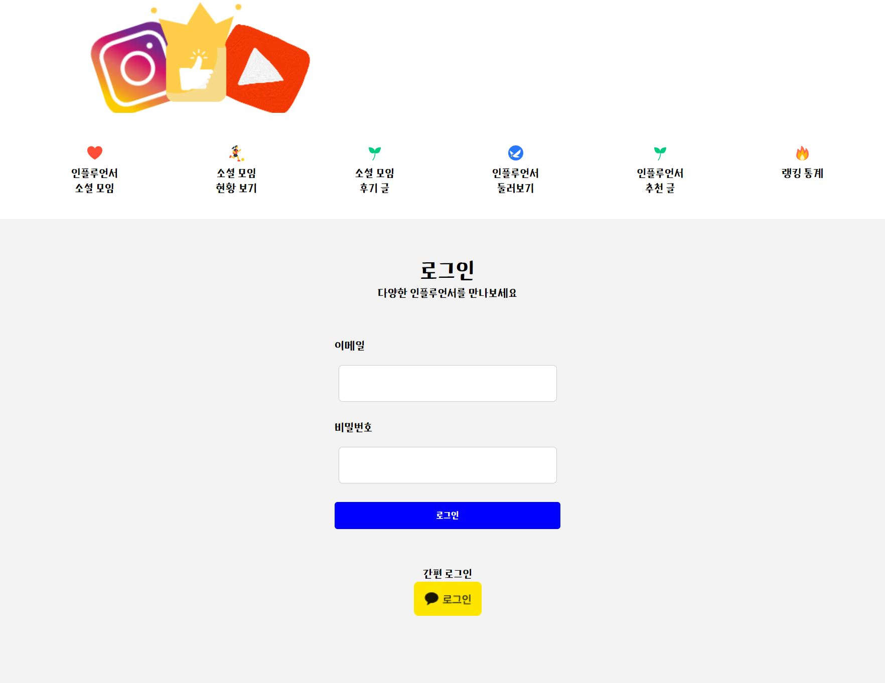<br>

### 소셜 모임 참가 

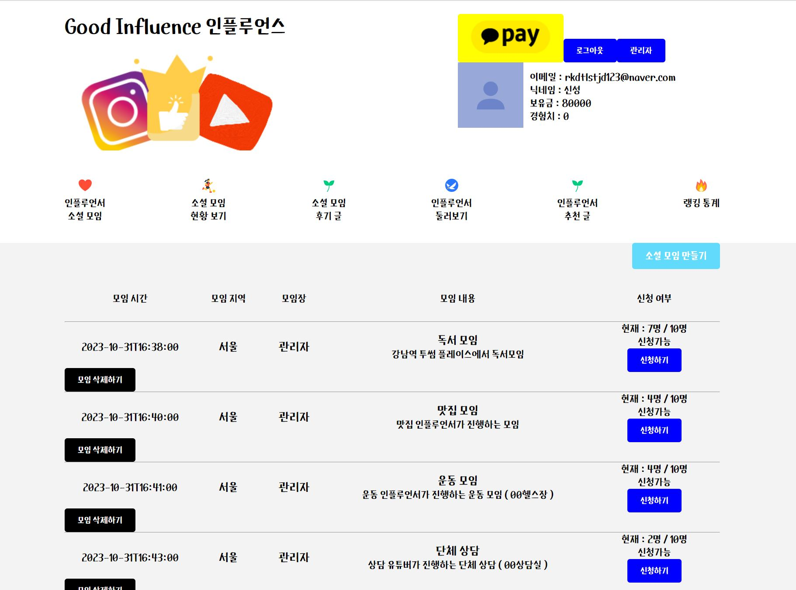<br>

### 참가 중인 소셜 모임 및 결제 내역

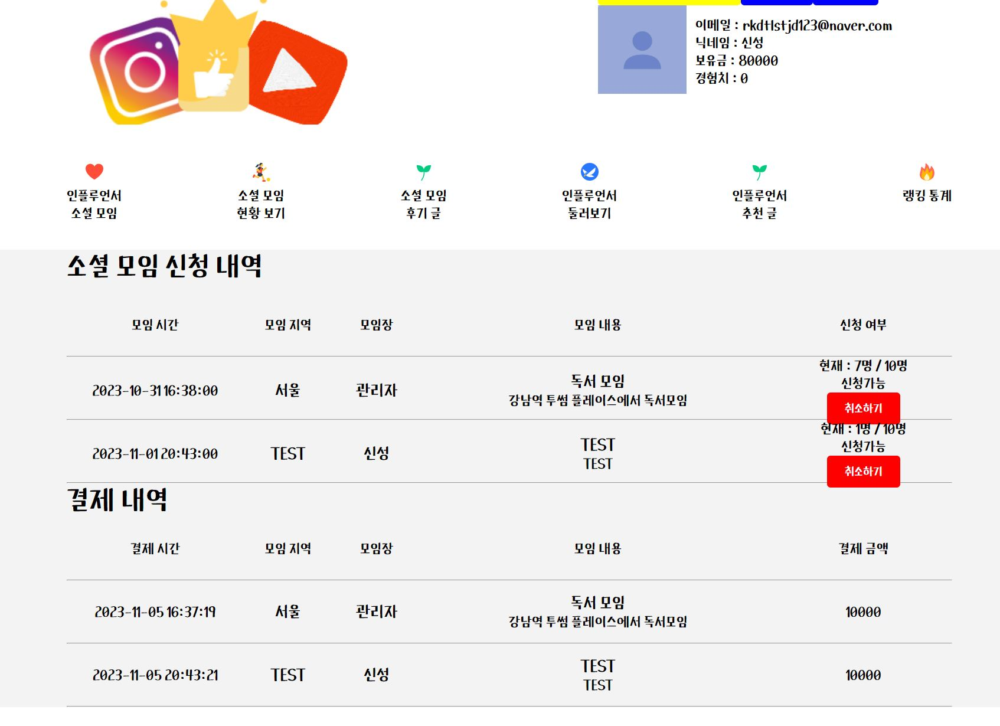<br>

### 소셜 모임 만들기

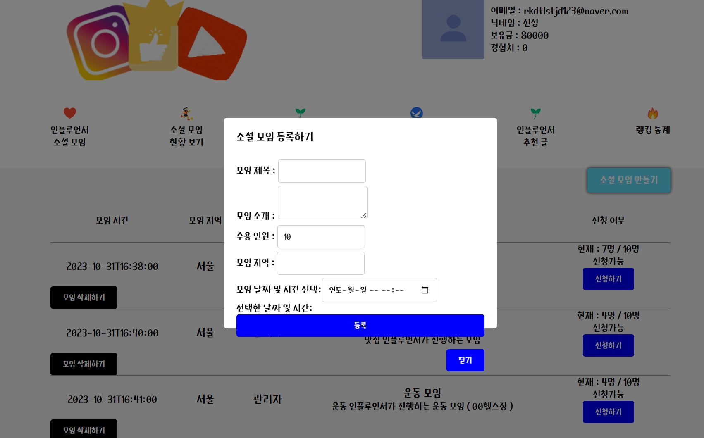<br>

### 소셜 모임 후기 게시글 

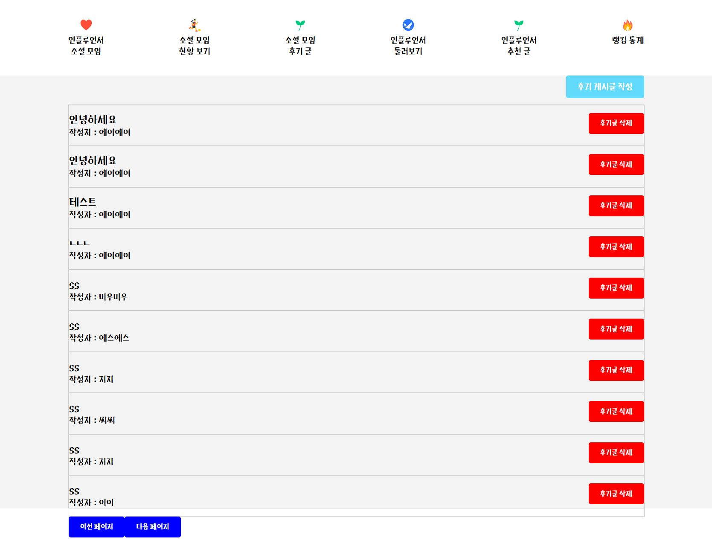<br>

### 후기 게시글 상세보기 및 댓글 

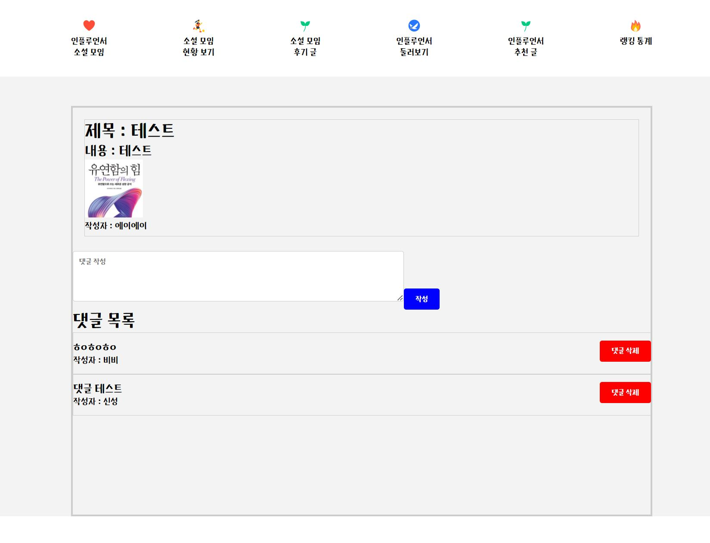<br>

### 인플루언서 등록 및 인증하기 

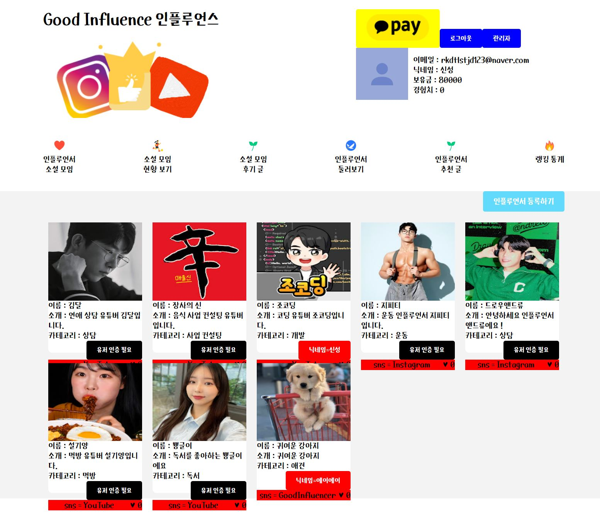<br>

### 인플루언서 추천 게시글 작성

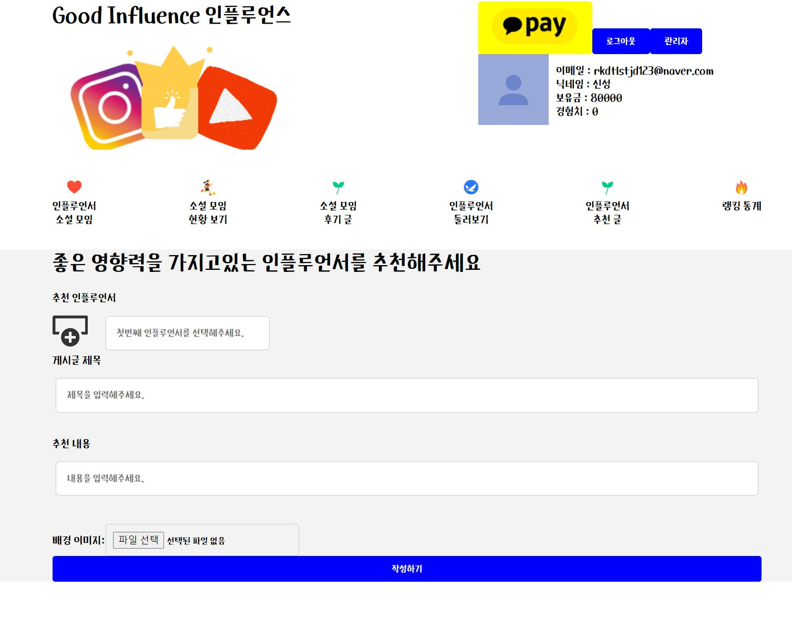<br>

### 인플루언서 찾아보기 검색 기능 

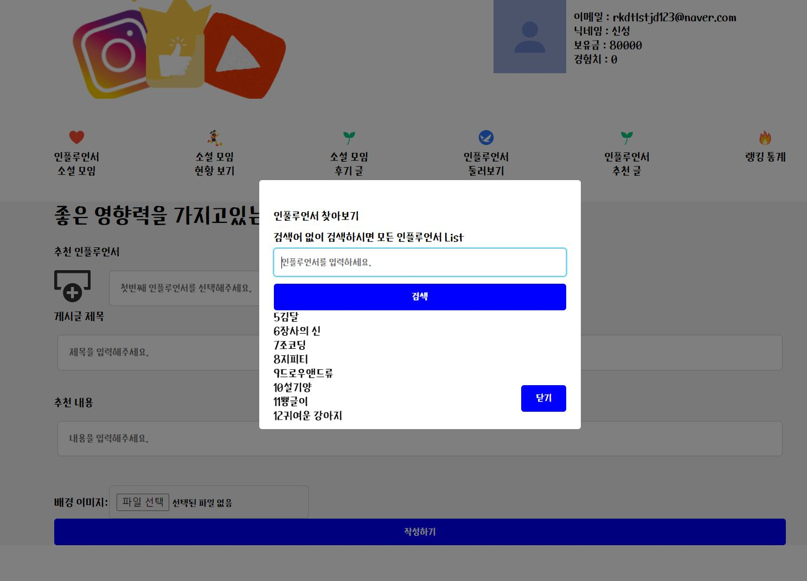<br>

### 인플루언서 추천 게시글 조회

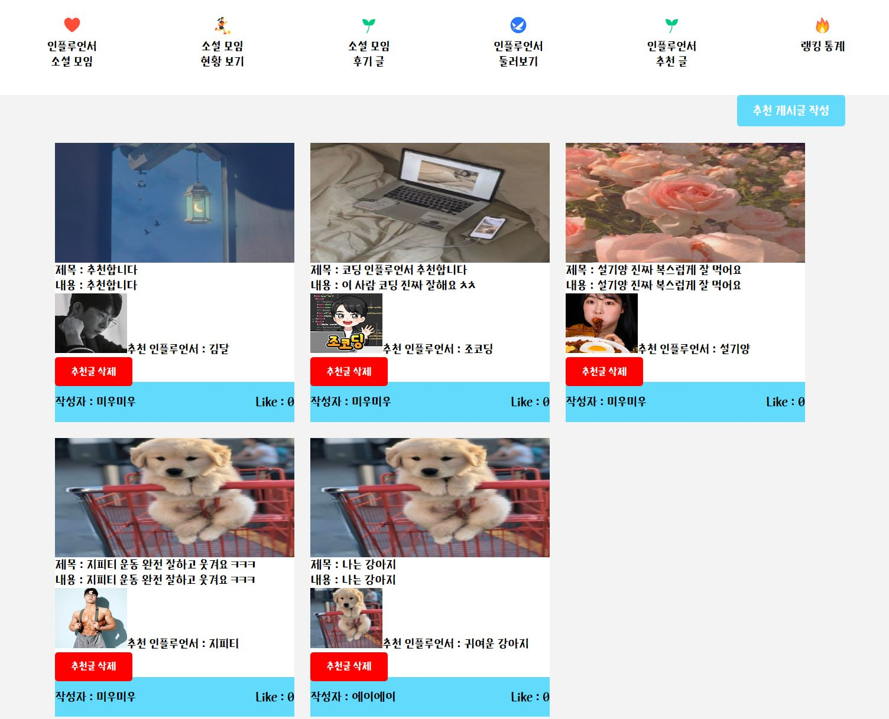<br>

### 활동 랭킹 보드 (통계) 

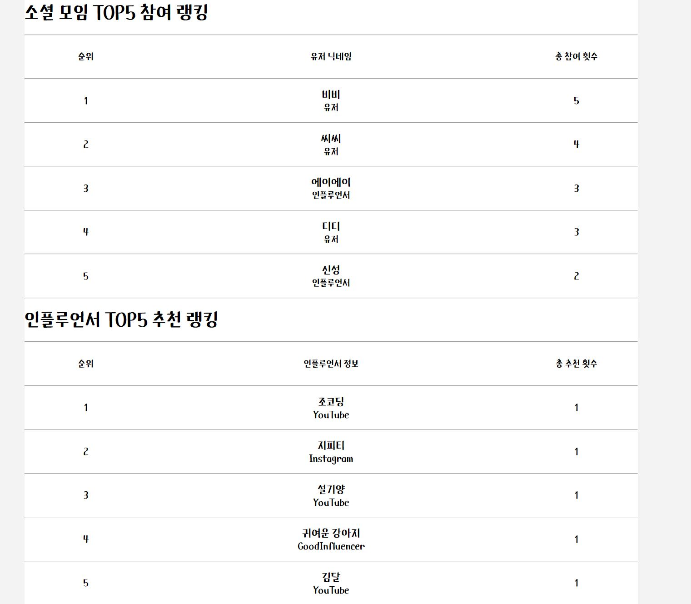<br>

### 관리자 기능 ( 인플루언서 권한 부여 , 유저 관리 )  

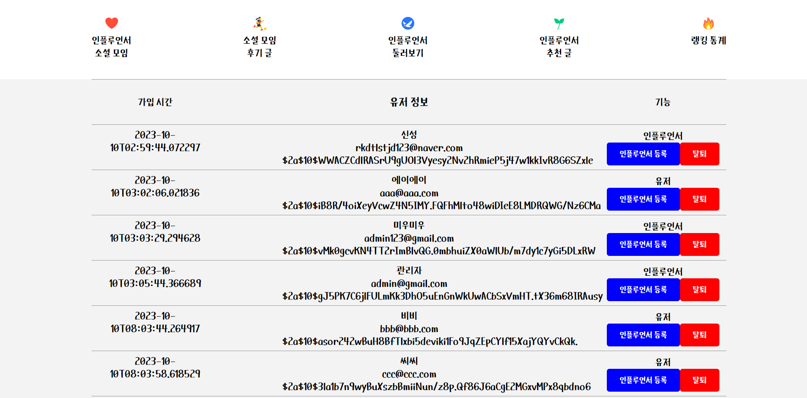<br>

